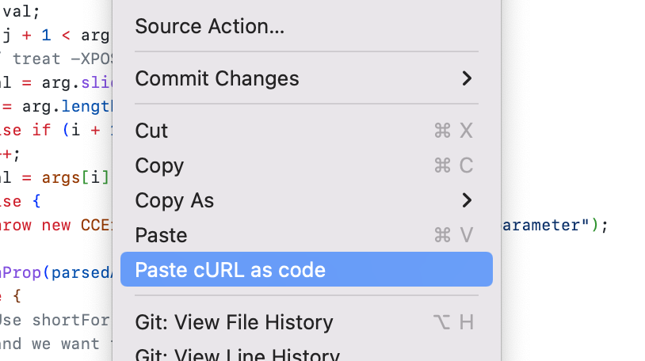

# curlconverter

This extension adds a "Paste cURL as code" option to the right click menu when you're editing a Python, JavaScript, PHP, R, Go, Java, Rust or JSON file.

The JSON output is [curlconverter](https://curlconverter.com/)'s parser's internal state.
